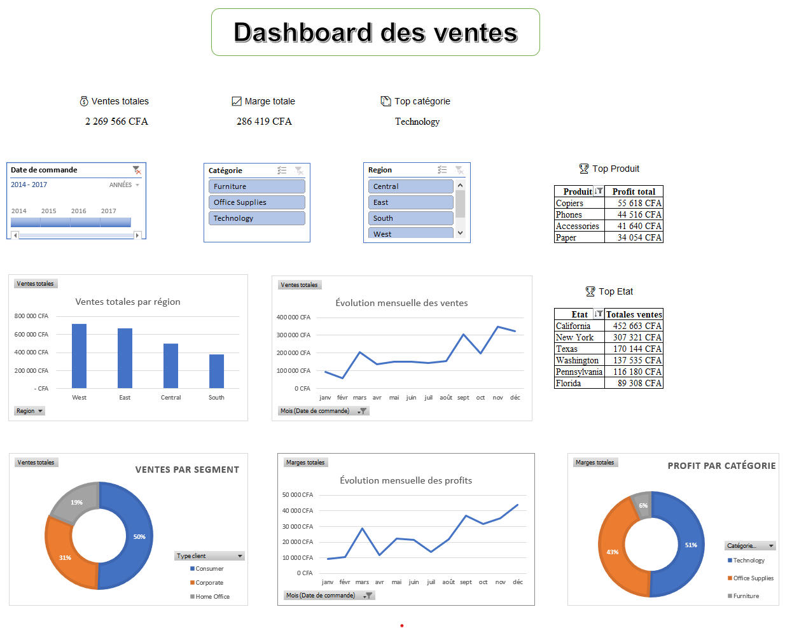

# 📊 Projet 1 — Dashboard Excel : Suivi des performances de ventes

## 🧠 Problématique métier

Une entreprise souhaite suivre les performances de ses ventes **par région** et **par catégorie de produits**, dans le but d’identifier les zones à améliorer. Pour cela, un tableau de bord interactif est nécessaire afin de visualiser les indicateurs clés de performance (KPI).

---

## 🎯 Objectifs du projet

- Transformer des données brutes issues d’un fichier CSV pour les rendre exploitables
- Construire un tableau de bord interactif avec Excel
- Visualiser les **KPI clés** : ventes, marges, top catégories/produits
- Suivre les performances **par région**, **par client**, et dans le temps

---

## 📂 Structure du fichier Excel

Le fichier Excel comporte plusieurs feuilles de travail :

1. **README_EXCEL** : Documentation et présentation du fichier Performance.xlsx
2. **Données brutes** : données initiales issues du fichier CSV
3. **Données nettoyées** : nettoyage et transformation des données
4. **TCD** : tableaux croisés dynamiques utilisés pour les analyses
5. **TCD_Graphiques** : graphiques préparés pour le tableau de bord
6. **Dashboard** : tableau de bord final interactif avec segments

---

## 📈 Aperçu du dashboard

### 🔍 KPI affichés :
- Ventes totales
- Marge totale
- Top catégorie
- Top produit
- Top État

### 📊 Visualisations :
- Ventes totales par région
- Ventes par type de client
- Évolution mensuelle des ventes
- Évolution mensuelle des profits
- Répartition des ventes par catégorie de produits

### 🎚️ Segments disponibles :
- Date
- Catégorie
- Région

---

## 🖼️ Capture d’écran du tableau de bord

---

## 📁 Accès au fichier Excel

> 💾 Vous pouvez télécharger le fichier Excel complet ici :

[📥 Télécharger le Dashboard Excel](dashboard.xlsx)

---

## 🚀 Résultat attendu

Grâce à ce tableau de bord interactif, l’entreprise peut :
- Suivre la performance globale de ses ventes
- Identifier les catégories et régions les plus rentables
- Réagir rapidement aux baisses de performance

---

## 🛠️ Outils utilisés

- **Microsoft Excel**
  - Tableaux croisés dynamiques (TCD)
  - Graphiques dynamiques
  - Segments interactifs
- **Fichier CSV** comme source de données

---

## 📌 Auteur

TOZO Koffi Géraud

---

## 📅 Date

Juillet 2025
