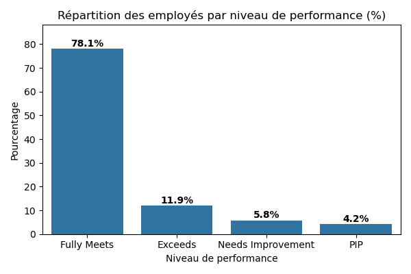
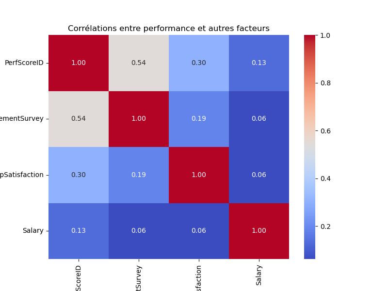

# 📊 Projet 2 — Analyse de la performance des employés - Projet RH orienté business

## 📌 Problématique métier

Une entreprise souhaite optimiser sa gestion RH en analysant les scores de performance, l’engagement, la satisfaction, et d’autres facteurs liés au profil des employés.

---

## 🧠 Objectifs du projet

- Identifier les variables qui influencent la performance des employés
- Analyser la distribution des scores selon des variables démographiques et RH
- Détecter les outliers (performeurs atypiques)
- Fournir des recommandations orientées métier

---

## 🗂️ Structure du notebook

Le projet suit une démarche analytique complète, avec un storytelling clair et orienté business :

### 1. 📍 Contexte métier
> L’entreprise souhaite améliorer sa stratégie RH en identifiant les facteurs liés à la performance et les écarts entre groupes d’employés.

### 2. 🔍 Exploration des données
> Dans cette étape, nous allons :
- Charger et examiner le jeu de données RH
- Comprendre la structure et les variables disponibles.

### 3. 🧍‍♂️ Profil des employés
> Exploration des employé selon :
- La répartition par sexe
- Le statut marital
- Le statut professionnel
- La répartition par département

### 4. 📈 Analyse de la performance
> Comparaison des scores de performance selon :
- Sexe
- Département
- Statut professionnel
- Statut marital  
> Corrélations avec engagement, satisfaction, salaire

### 5. 🚨 Identification des profils atypiques
> Isolation des employés très performants ou très faibles.  
> Étude de leurs caractéristiques : facteurs communs ? leviers à renforcer ou corriger ?

### 6. ✅ Recommandations RH
> Propositions concrètes pour :
- Fidéliser les top performers
- Accompagner les underperformers
- Réduire les écarts entre groupes

---

## 🛠️ Compétences mobilisées (outils et technologies)

- Nettoyage et préparation des données (`pandas`)
- Analyse exploratoire (`EDA`)
- Visualisation des données (`matplotlib`, `seaborn`)
- Calculs statistiques (corrélations)
- Détection d'outliers
- Interprétation métier et recommandations RH

---

## 📎 Exemple de visualisations

  

---

## 🧠 Résultats clés

- **L'engagement** est le facteur le plus lié à la performance (corrélation = 0.54)
- **La satisfaction** a également un lien positif avec la performance
- Les **employés très performants** sont mieux rémunérés, plus engagés et plus satisfaits
- Les **sous-performants** montrent un manque d’engagement fort
- Des recommandations RH sont proposées pour améliorer les performances globales

---

## 📂 Fichiers du repo

- [📥 Télécharger le notebook principal](notebook_projet_2.ipynb)

-👉 [Ouvrir le notebook dans Google Colab](https://colab.research.google.com/github/GeraudTozo/DATA-ANALYST-PROJECT/blob/main/P2/notebook_projet_2.ipynb)

- Consulter le notebook  : 

- `data/` : données brutes https://www.kaggle.com/datasets/rhuebner/human-resources-data-set

- `assets/` : visualisations exportées

---

## 📌 Auteur

TOZO Koffi Géraud
📫 [coco.geraud@gmail.com] 

---

## 📅 Date

Juillet 2025