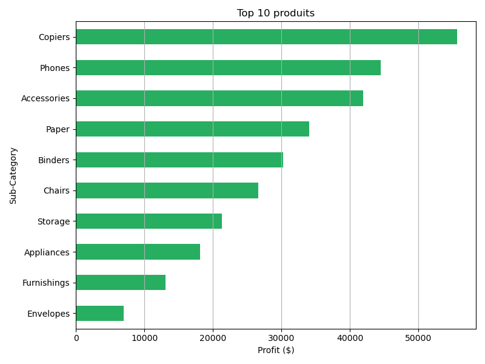
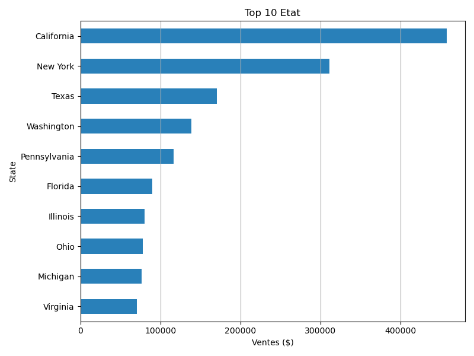
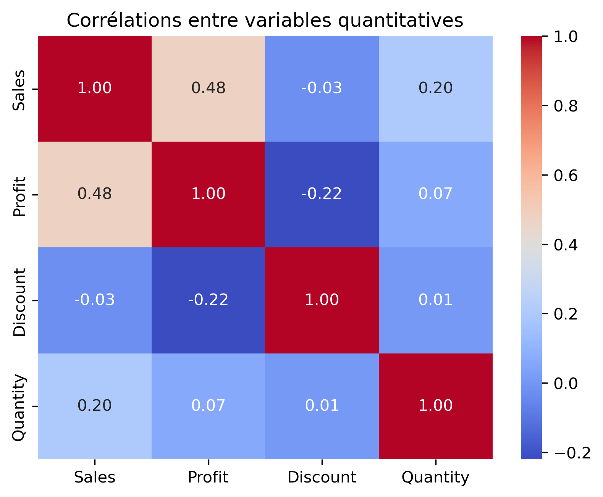

# 📊 Projet 3 — Identifier les facteurs qui influencent les performances commerciales 

Ce projet a pour objectif de comprendre les écarts de performance commerciale selon les **produits**, **régions**, **segments clients** et **stratégies de remise**, afin d’identifier les leviers de rentabilité et formuler des recommandations concrètes pour les équipes de direction commerciale.

---

## 🧠 Objectifs du projet

- Identifier les variables qui influencent les **ventes** et la **rentabilité**
- Analyser les écarts de performances selon les **régions**, **catégories** et **segments**
- Détecter les leviers négatifs (ex : remises excessives)
- Fournir des recommandations orientées **stratégie commerciale**

---

## 🗂️ Structure du notebook

Le projet suit une démarche analytique complète, avec un **storytelling clair et orienté décision** :

### 1. 📍 Contexte métier
> L’entreprise cherche à optimiser sa stratégie commerciale en analysant l’impact des produits, remises et zones géographiques sur ses marges et ventes.

### 2. 🔍 Exploration des données
> Description du portefeuille de vente : catégories de produits, clients, régions, quantités, remises, marges, délais de livraison.

### 3. 📈 Vue d'ensemble des performances
> Analyse des performances :
- Aperçu des performances globales (somme des ventes et profits)
- Ventes et profits par catégorie de produit
- Ventes et profits par région
- Ventes et profits par segment client
- Visualisation des produits les plus vendus et des plus rentables

### 4. 📊 Interactions entre variables quantitatives
> Corrélation entre :
- Ventes et Profit
- Profit et Discount (remises)
- Quantités et ventes

### 5. 📊 Interactions entre variables qualitatives et quantitatives
> Realisation de visualisation et tests statistiques (Kruskal-Wallis) :
- Vente par région
- Vente selon le segment client
- Vente selon la catégorie produits
- Profit selon la catégorie produits

### 6. 📊 Interactions entre variables qualitatives
> Verification de l'independance avec le test de Khi-deux entre :
- Segment clients et région
- Segment clients et categorie produits
- Catégorie produits et région

### 7. ✅ Recommandations stratégiques
> Propositions concrètes pour :
- Améliorer la rentabilité (maîtriser les remises)
- Prioriser les régions/segments à fort potentiel
- Poursuivre et renforcer les segments porteurs

---

## 🛠️ Compétences mobilisées (outils et technologies)

- Préparation et nettoyage de données (`pandas`)
- Analyse bivariée (`corr`, `groupby`, ANOVA)
- Visualisation avancée (`matplotlib`, `seaborn`)
- Test d’hypothèses statistiques (`scipy`, `statsmodels`)
- Interprétation métier orientée stratégie commerciale

---

## 📎 Exemple de visualisations

---

## 🧠 Résultats clés

- Les **remises supérieures à 20 %** sont fortement liées à une chute des profits
- Le segment **"Home Office"** est le plus rentable malgré un volume de vente moindre
- La région **"West"** surperforme dans la catégorie **"Technology"**
- Certaines sous-catégories très vendues génèrent des **marges faibles** → à surveiller
- Des recommandations claires sont formulées pour ajuster la stratégie produit/région/remise

---

## 📂 Fichiers du repo

- [📥 Télécharger le notebook principal](notebook_projet_3.ipynb)

- Consulter le notebook  : 

- `data/` : données commerciales brutes (https://www.kaggle.com/datasets/vivek468/superstore-dataset-final)

- `assets/` : visualisations exportées (heatmaps, boxplots, barplots, etc.)

---

## 📌 Auteur

TOZO Koffi Géraud
📫 [coco.geraud@gmail.com] 

---

## 📅 Date

Juillet 2025